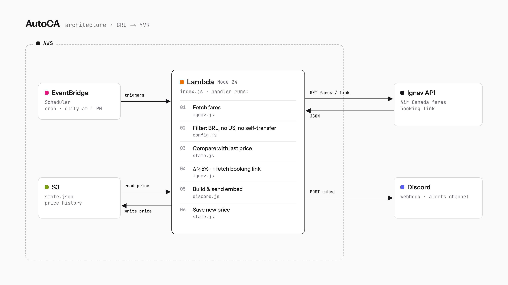
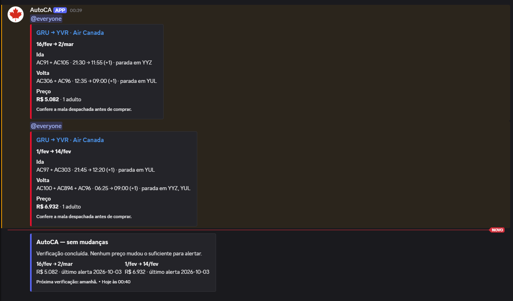

# AutoCA

<p align="center">
  
</p>

<p align="center">
  AutoCA is a serverless Node.js bot that monitors Air Canada fares on the <strong>GRU → YVR (Vancouver)</strong> route and sends Discord alerts whenever the price changes by 5% or more — up or down.
</p>

<p align="center">
  
  
  
  
  
</p>

---

## Architecture
- Video presentation
https://youtu.be/yGnGs8n33WI
<p align="center">
  
</p>

Every day at 1 PM (Brazil time), EventBridge Scheduler triggers a Lambda function that fetches fares from the Ignav API, filters them, compares against the last alerted price stored in S3, and fires a Discord embed if anything changed.

---

## Features

- **Price change alerts** — pings `@everyone` on Discord when a fare rises or drops ≥ 5%
- **Daily status card** — sends a neutral summary when no prices changed, so you always know the bot ran
- **Smart filtering** — drops itineraries with US layovers, self-transfers, or departures on the blocked date (Feb 15)
- **Booking links** — Air Canada link embedded in the card title; agency link shown above as a subtle sublink
- **Partial error reporting** — notifies on Discord if any individual search fails, not just total outages
- **Zero infrastructure cost** — fits entirely within AWS Lambda and S3 free tiers

---

## How It Works

1. **Fetch** — searches round-trips for both date combinations via Ignav API (Air Canada only, up to 2 stops)
2. **Filter** — removes self-transfers, non-BRL fares, US airport layovers, and blocked dates
3. **Compare** — picks the cheapest valid itinerary and checks if it changed ≥ 5% from the last alert
4. **Link** — fetches the booking link for the winning itinerary from Ignav
5. **Alert** — posts a Discord embed with flight details, price delta, and direct purchase link
6. **Save** — writes the new price to `state.json` in S3 for next day's comparison

---

## Discord Alerts

> Alerts are in Portuguese 🇧🇷

<p align="center">
  
</p>

| Type | Trigger | Color |
|------|---------|-------|
| Price alert | ≥ 5% change (up or down) | 🔴 Air Canada red + `@everyone` |
| Status card | No changes detected | 🟣 Neutral purple |
| Error notice | Search or API failure | ⚠️ Plain text warning |

---

## Configuration

All settings live in `config.js`. Secrets are environment variables — never committed.

| Variable | Description |
|----------|-------------|
| `IGNAV_API_KEY` | Ignav API key (`X-Api-Key` header) |
| `DISCORD_WEBHOOK_URL` | Discord channel webhook URL |
| `STATE_BUCKET` | S3 bucket name for `state.json` (omit for local file) |

Key config options:

```js
maxPriceBRL: 7000,        // price ceiling in BRL
dropAlert:   0.05,        // 5% threshold for alerts
trips: [
  { out: '2027-02-16', ret: '2027-03-02', priority: true },
  { out: '2027-02-01', ret: '2027-02-14' },
],
blockedDate: '2027-02-15' // must be in Brazil this day
```

---

## Local Setup

```bash
# 1. Clone and install
git clone https://github.com/TiagoPortilho/AutoCA.git
cd AutoCA
npm install

# 2. Configure secrets
cp .env.example .env
# edit .env with your keys

# 3. Run
node --env-file=.env index.js --dry-run      # prints alert without posting
node --env-file=.env index.js --test-discord  # sends a test ping to Discord
node --env-file=.env index.js                 # full run
```

> Without `STATE_BUCKET` set, state is saved locally as `state.json`.

---

## Project Structure

```
AutoCA/
├── index.js      # Lambda handler + CLI entry point
├── config.js     # Routes, dates, filters, thresholds
├── ignav.js      # Ignav API calls (search + booking links)
├── discord.js    # Embed builder + webhook sender
├── state.js      # State read/write (local file or S3)
├── public/
│   └── AutoCA-architecture.png
└── docs/
    └── Plano do bot de passagens GRU to Vancouver.md
```

---

## AWS Deployment

| Resource | Config |
|----------|--------|
| Lambda | Node 24, 256 MB, 3 min timeout |
| S3 | Standard storage, versioning enabled, SSE-S3 encryption |
| EventBridge Scheduler | `cron(0 13 * * ? *)` — `America/Sao_Paulo` |

The Lambda execution role needs `s3:GetObject` and `s3:PutObject` on the state bucket.

---

## License

MIT License
